# 深开鸿的开源鸿蒙KaihongOS，故事第二集，可以来吃瓜了

> 上周发了深开鸿的KaihongOS系统相关的故事第一集，提示了网上很多人的思维偏差，KaihongOS的livecd安装虽然使用了Debian这个Linux，但是，安装的内容是纯正的KaihongOS，不是Linux系统。今天来看看kaihongOS这个系统的故事。

## 一、启动KaihongOS

接上一集故事里面的安装，按照向导一步一步执行下去，最后提示重新启动，就是安装完成了。

拔掉安装的云固件U盘，重启计算机。

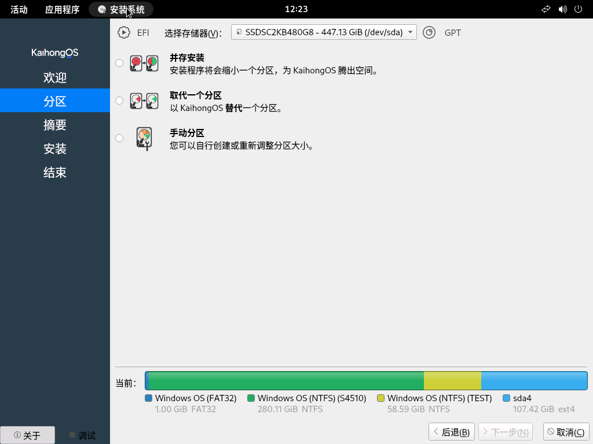

我这台机器有两块硬盘，可以选择启动，默认是云固件引导，选择KaihongOS所在的硬盘引导。

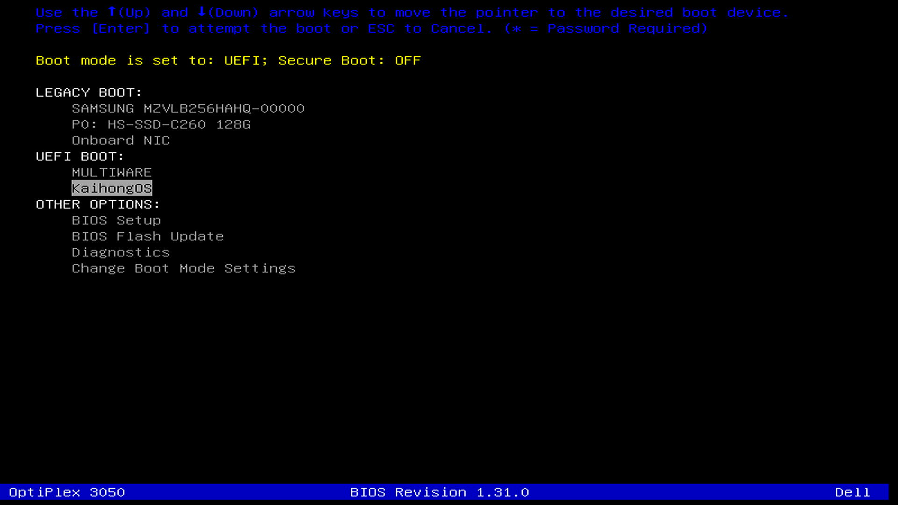

启动后，选择KaihongOS，就可以进入系统。

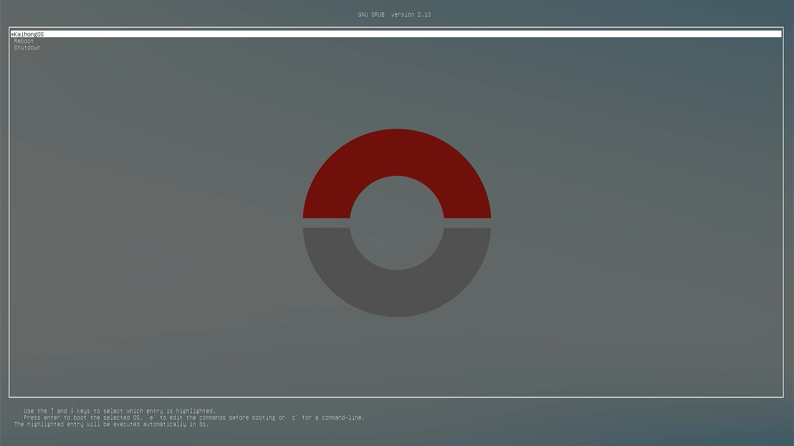

选择默认项。

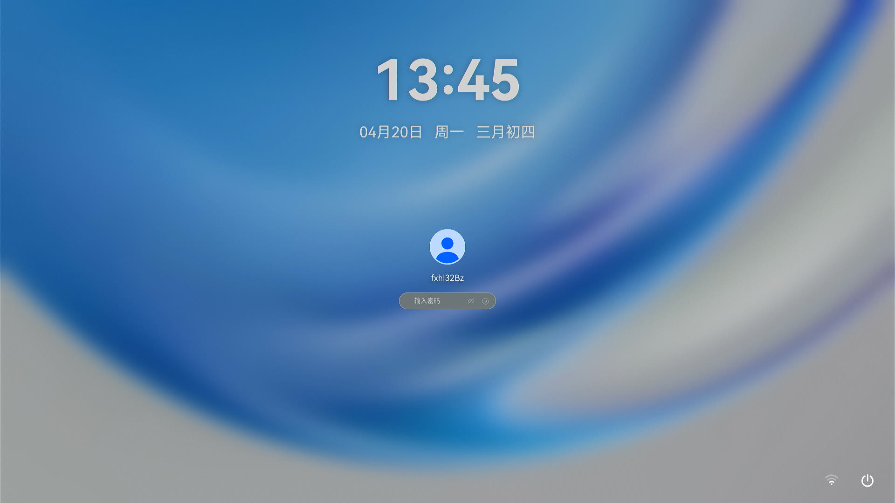

KaihongOS，目前基本上就是空壳，我就截屏供大家脑补想象体验了。

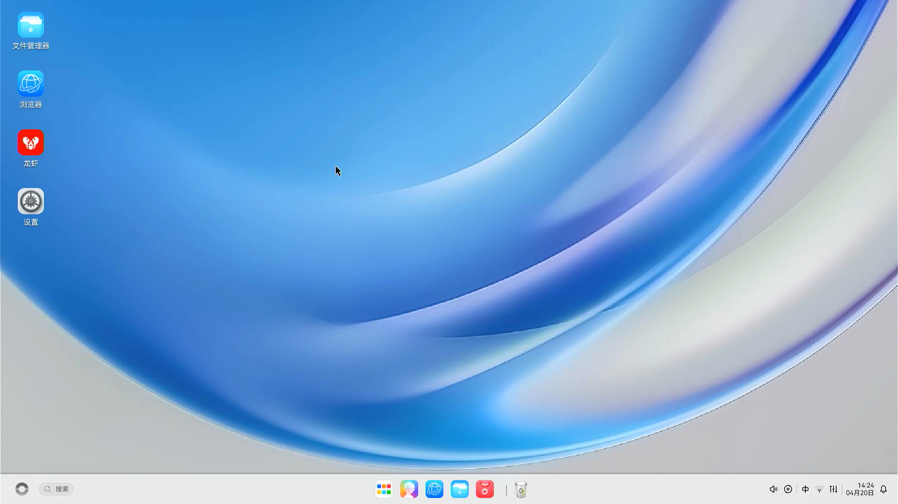

应用程序

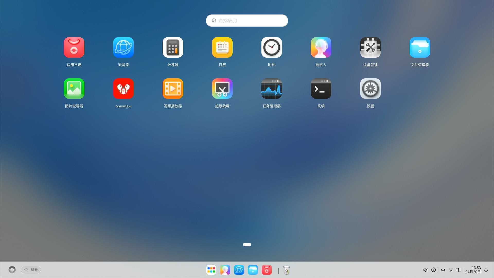

应用商店

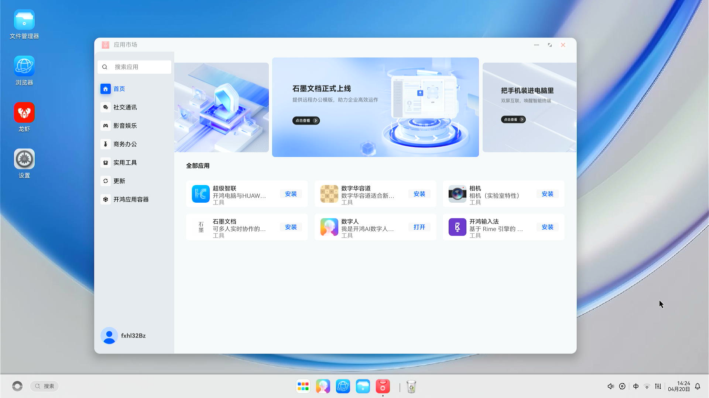

文件管理

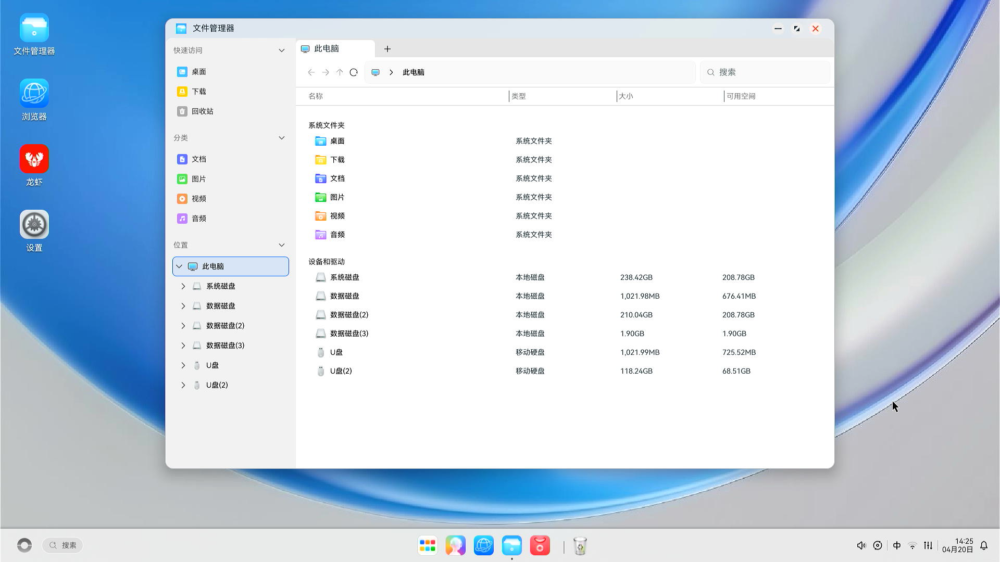

终端

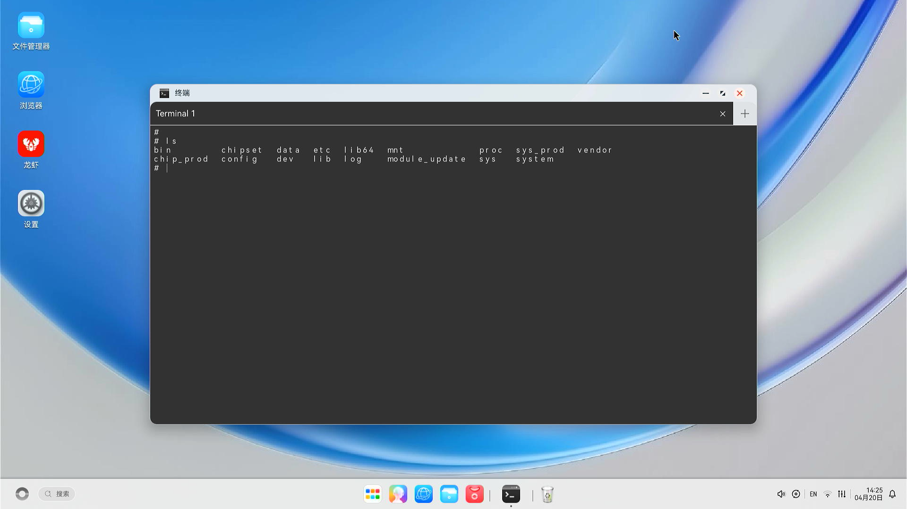

系统信息

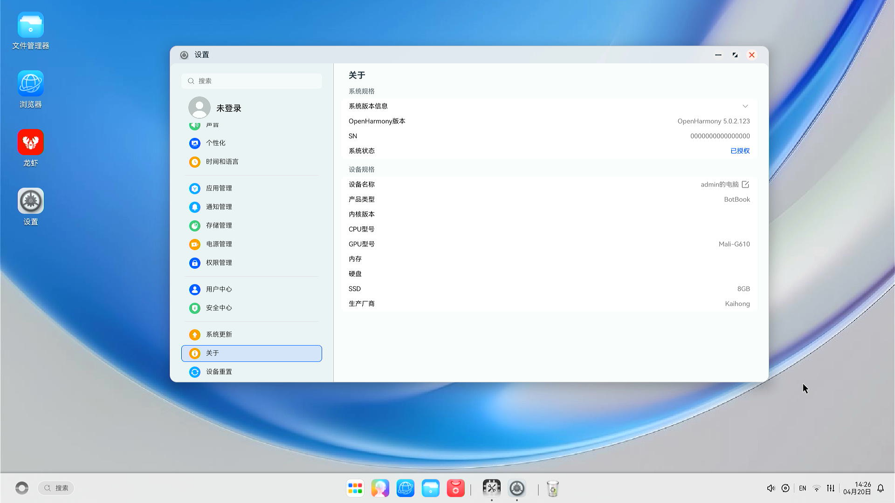

整体UI/UE感受还是不错的。

## 二、KaihongOS引导分析

在上一章里面，我们可以看到KaihongOS的引导程序，熟悉Linux的读者应该一眼就可以看出来是GRUB了。

我们在GRUB界面上，直接按 **"e"**，进入编辑模式，就可以查看kaihong这个启动项目的指令和参数了。

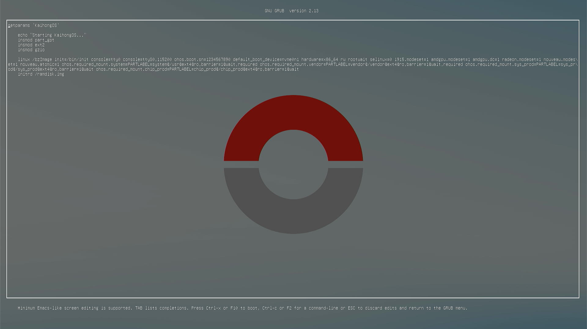

如图，我们可以看到有linux指令代表的内核文件，还有initrd代表的内存盘文件，以及启动时给内核传递的很长的参数。

参数里面很多都是硬件驱动使用的参数，咱们就不再探讨了。

这些参数，也可以直接查看grub.cfg配置文件获取。

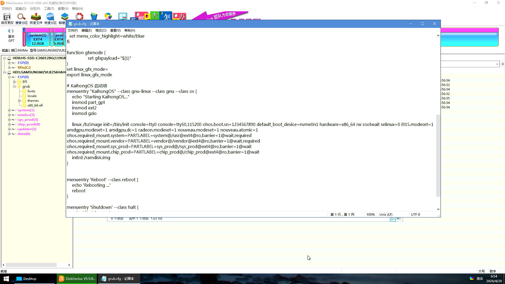

通过上面分析，我们可以确认KaihongOS的内核引导，虽然小助手没看过源码，不能肯定说就是Linux，但是可以肯定借鉴了Linux的内核加载模式。

再补充一个小细节，启动时，屏幕左上角出现了这么一句话，这句话是Linux内核的EFI引导模块打印输出的。所以嘛，就是所以嘛，这个细节就不用说那么透彻了。


## 三、使用云固件引导

在测试机上，KaihongOS安装在第二块硬盘里面，属于物理机分区安装，算不上云固件支持的镜像模式，但也可以通过类似本地Windows系统的模式来实现整合到云固件主界面引导。

另外，KaihongOS使用GRUB来引导，咱们也可以使用云固件来进行二次引导。

进一步来讲，KaihongOS的引导指令基本上等同于Linux，咱们设置可以使用云固件的Kernel模式来跳过GRUB进行引导。

### 3.1 “loader”模式

在KaihongOS所在的硬盘ESP分区根目录下添加云固件配置文件vd.config，内容如下：

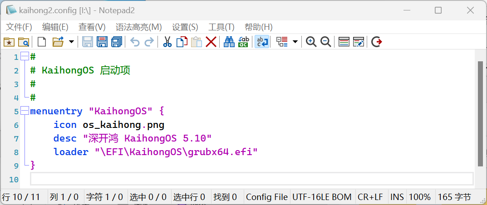

```bash
menuentry "KaihongOS" {
    icon os_kaihong.png
    desc "深开鸿 KaihongOS 5.10"
    loader "\EFI\KaihongOS\grubx64.efi"
}

```

图片os_kaihong.png复制到根目录。

重启计算机，用云固件启动，就可以看到KaihongOS的镜像图标，选中回车，就可以出现GRUB界面，继续选择就可以进入KaihongOS了。

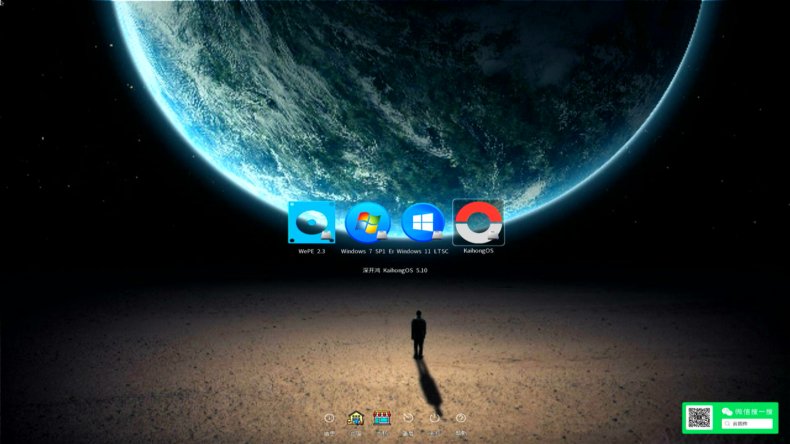

## 3.2 “kernel”模式

Kernel模式直接跳过GRUB引导Linux系统。在镜像模式下，需要把内核文件vmlinuz和虚拟盘文件initrd.img复制出来。但现在是物理机分区安装，文件都是现成的，所以直接就可以使用了。

同样，在KaihongOS所在的硬盘ESP分区根目录下添加云固件镜像配置文件vd.config，内容如下：

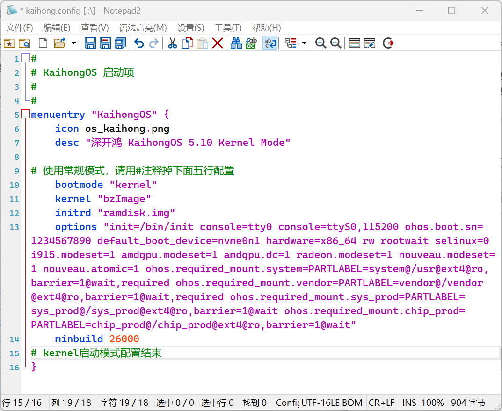

```bash
menuentry "KaihongOS" {
    icon os_kaihong.png
    desc "深开鸿 KaihongOS 5.10 Kernel Mode"

# 使用常规模式，请用#注释掉下面五行配置    
    bootmode "kernel"
    kernel "bzImage"
    initrd "ramdisk.img"
    options "init=/bin/init console=tty0 console=ttyS0,115200 ohos.boot.sn=1234567890 default_boot_device=nvme0n1 hardware=x86_64 rw rootwait selinux=0 i915.modeset=1 amdgpu.modeset=1 amdgpu.dc=1 radeon.modeset=1 nouveau.modeset=1 nouveau.atomic=1 ohos.required_mount.system=PARTLABEL=system@/usr@ext4@ro,barrier=1@wait,required ohos.required_mount.vendor=PARTLABEL=vendor@/vendor@ext4@ro,barrier=1@wait,required ohos.required_mount.sys_prod=PARTLABEL=sys_prod@/sys_prod@ext4@ro,barrier=1@wait ohos.required_mount.chip_prod=PARTLABEL=chip_prod@/chip_prod@ext4@ro,barrier=1@wait"
    minbuild 26000
# kernel启动模式配置结束  
}
```

这里面options的参数可以直接从grub.cfg里面截取。

重启计算机，用云固件启动，同样也可以看到KaihongOS的镜像图标了。

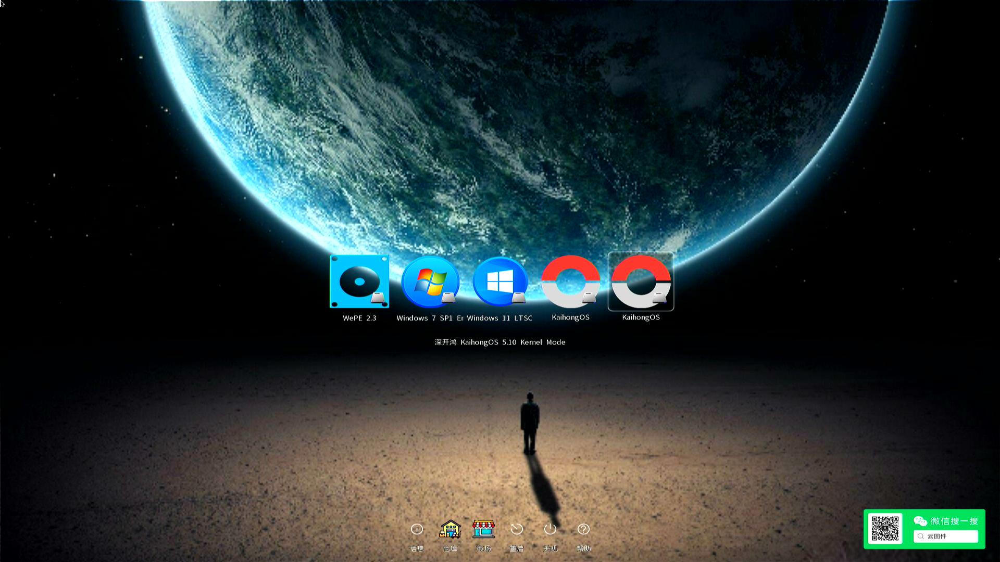

小助手这里直接把两个启动项都添加到一起了。选中第二个KaihongOS，就跳过GRUB，直接开始KaihongOS的跑码模式进系统了。

## 四、KaihongOS到底是什么系统

经过上面的测试，我们已经发现，这个KaihongOS，在云固件引导的角度上来看，和普通的Linux一般无二。那能不能下个结论说KaihongOS就是Linux呢？

如果我把这个话题发互联网上，那么肯定就会受到口诛笔伐，被唾沫星子醍醐灌顶了。

**咱不看网络上怎么说，咱尊重事实，是还是不是，咱们来看细节判读，不要人云亦云。**

进入终端，使用查看Linux常用的uname来查看内核信息。

```bash
uname -a
uname -r
cat /proc/version
```

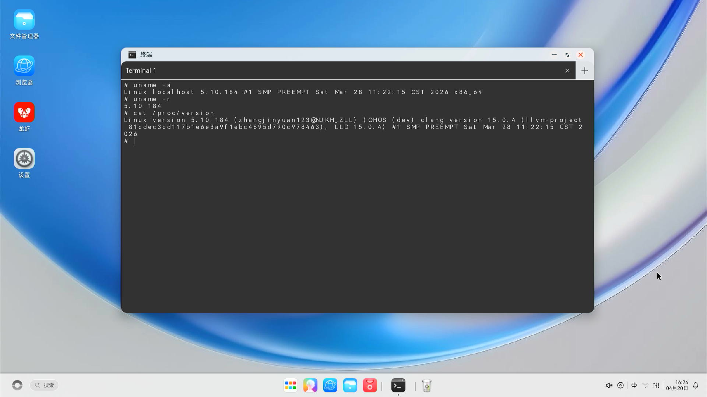

这结果，提供了一些信息，但也不能说明是什么。

进入根目录，ls看看文件系统构成。


这结构，完全看不懂，和普通Linux或者Unix相差都很大。

再盗用网上查看鸿蒙系统的版本的命令来看看。

```bash
cat /etc/param/ohos.para | grep const.product.software.version
```

或者

```bash
param get const.product.software.version
```


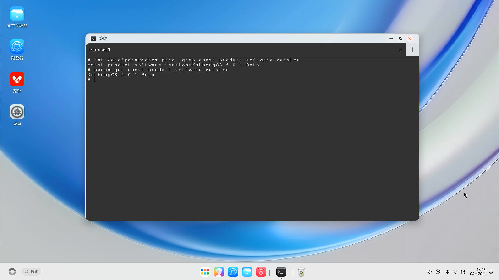

这里终于显示鸿蒙的版本了。

通过上述两个步骤， **我们既看到了Linux，又看到了OpenHarmony，两者兼有**。

其实，系统架构直接看深开鸿官方的说明就更加直接了。

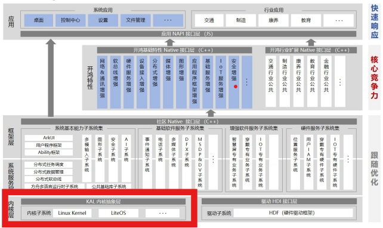

左下角，内核子系统，很清楚的列着 **“Linux Kernel”**。

经过这些步骤，我们大致可以得到这样一个结果。

**KaihongOS像是一个在Linux内核基础上二次开发的混合系统，有Linux的基础，也有很多非Linux的扩展，非常像Android和ChromeOS这样的系统类型。**

上述结论，可以告诉我们KaihongOS不是Linux，但也不是没有Linux，不能用是或者不是Linux或者鸿蒙来定义，它不是其他任何别的东西，它就是KaihongOS。

顺便提一句，视频号里面“某某说科研”博主也是居心叵测，批评其他人说KaihongOS是Debian的同时，使用鸿蒙的信息强调KaihongOS是纯正鸿蒙，不是Linux，全部都是国产代码，鼓动人心，这种人物搬弄是非，挑动网络舆论，还谈什么科研，尊重事实都做不到。（ **个人观点，仅供参考** ）

## 五、最终疑问，能不能做成云固件镜像

分析完了KaihongOS，咱们可以发现存在了很多Linux内核的基础，那能不能把小助手最近花费无数心血开发的内核模块移植到KaihongOS里面，使得KaihongOS支持镜像文件启动呢？

我们来看一个细节

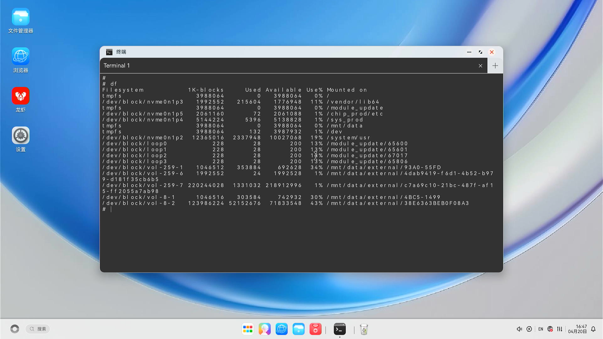

这里可以看到KaihongOS使用了很多loop这个内核模块支持的虚拟磁盘。

云固件自研的Linux内核模块，也是在loop这个模块基础扩展，显然，如果能够二次开发，那么肯定可以支持云固件镜像这种超级方便的系统部署和启动模式的。

于是，小助手就开始申请获取二次开发资料。一次，又一次，再一次。

|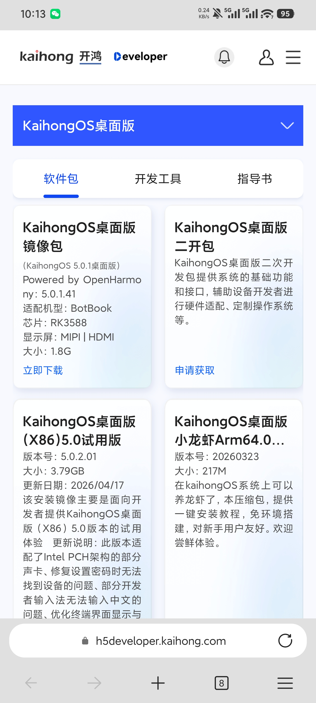 |  | 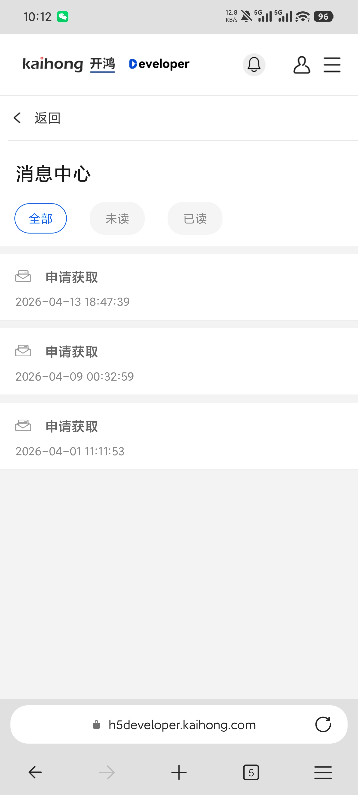|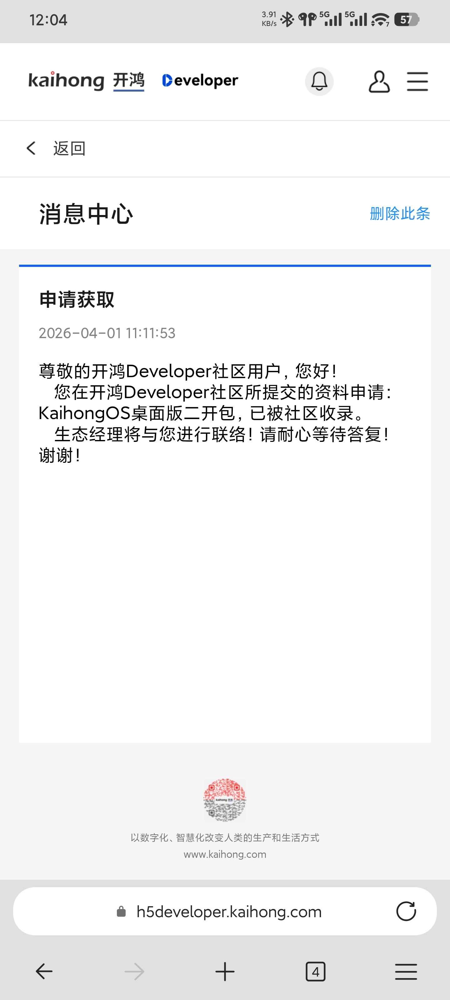 |
| :--- | :--- | :--- | :--- |


没人响应，那就在有活人的QQ群提问吧。

然后，深开鸿牌皮球挺滑溜的。这样也不行，那直接召唤神龙，微博AT深开鸿老板吧。

|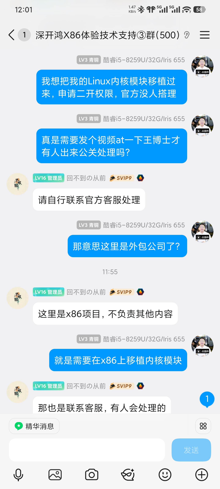 |  | 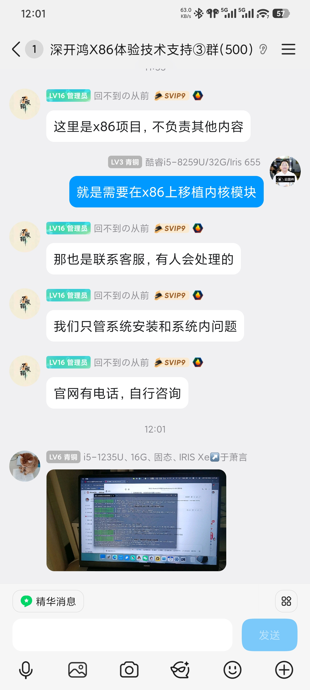|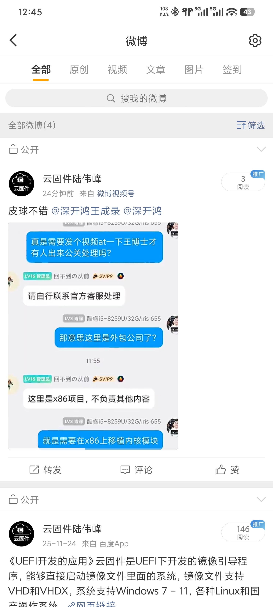|
| :--- | :--- | :--- |  :--- | 

时间就这样一天又一天过去了。。。就是没人搭理。。。

反正我不急，资料嘛，早看也是看，晚看也是看，看不完的，等着吧。。。

## 六、总结

深开鸿的KaihongOS是一个经过无数人心血叠加开发的操作系统。操作系统本身不是一个一蹴而就的成果，需要非常多的积累，也不存在是与非的问题。国产系统不代表不使用其他代码，由国人维护，由国人更新，都可以算是国产系统。

计算机的世界，只有0和1，但是科研成果本身就是复杂的、精密的、充满艰辛的结果。

望网络上看待鸿蒙、华为鸿蒙、开源鸿蒙、KaihongOS产生决裂的两边人，都清晰的、辩证的看待这些内容，不要成为搅动舆论的那些阴险小人的搅屎棍而不自知。

最后，对于加入国产系统战团的企业们，既然提供服务，那么就做好服务。系统都是程序员开发出来的，服务好给你系统做贡献的开发者，才能赢得更多人使用。